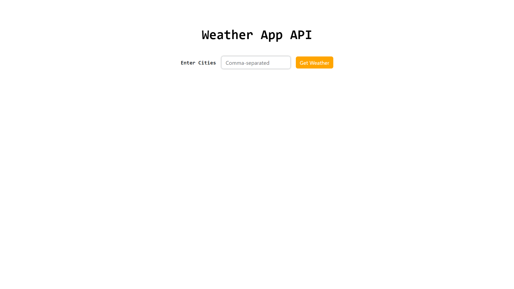
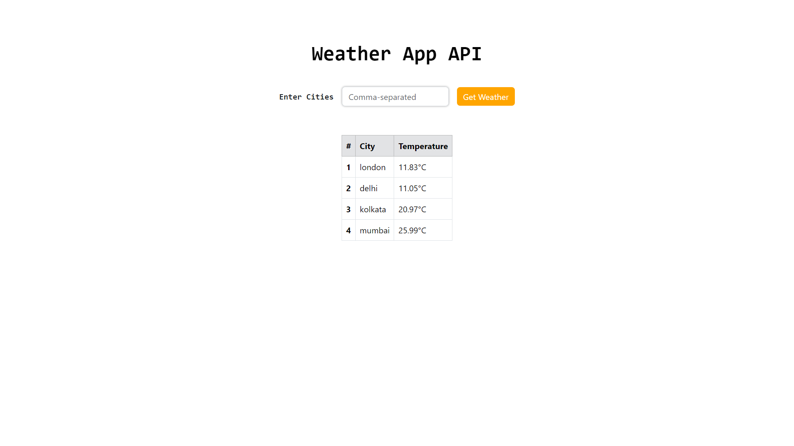
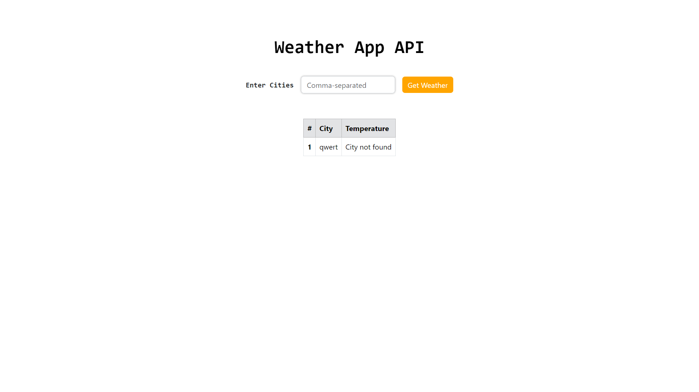
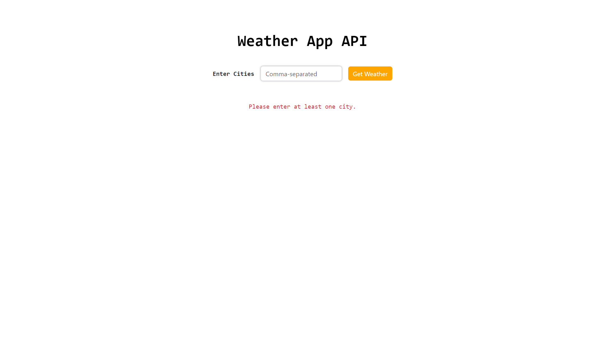

# Weather App API

## Overview

This is a simple web application that allows users to get the real-time temperature information for multiple cities using the OpenWeatherMap API. The project consists of two main parts: the API server (`apiServer.js`) responsible for handling weather data requests, and the UI server (`uiServer.js`) serving the user interface.

## Features

- Users can input a list of cities, submit the form, and receive the current temperature for each city.
- Error handling for invalid cities or API errors.
- Responsive UI with Bootstrap styling.

## Technologies Used

- Node.js
- Express.js
- Axios
- OpenWeatherMap API
- Bootstrap

## Getting Started

### Prerequisites

- Node.js installed
- OpenWeatherMap API key (instructions below)

### Installation

1. **Clone the repository:**

   ```bash
   https://github.com/sramakrishnaa/weatherAPI-app.git
2. **Navigate to the project directory:**

   ```bash
   cd weather-app-api
3. **Install dependencies:**

   ```bash
   npm install

### Configuration
1. **Get an OpenWeatherMap API Key:**
   - Visit [OpenWeatherMap](https://openweathermap.org/) and sign up for a free account.
   - Obtain your API key from your account dashboard.
2. **Configure the API server:**
   - Open apiServer.js.
   - Replace the placeholder apiId with your OpenWeatherMap API key.

## usage
1. **Start the API server:**

   ```bash
   nodemon apiServer.js
2. **Start the UI Server:**
   ```bash
   nodemon uiServer.js

The API server will be running at http://localhost:3000, and the UI server at http://localhost:4000.

3. **Open your browser and visit http://localhost:4000 to use the Weather App API.**

## Screenshots
1. User successfully runs the application at `http://localhost:4000`.
   
2. User inputs multiple cities in the form and submits.
   
3. User enters an invalid city name.
   
4. User submits the form without entering any cities.
   


## Contributing
Contributions are welcome! If you find any issues or have improvements to suggest, please open an issue or submit a pull request.

## License

This project is licensed under the [MIT License](LICENSE).
